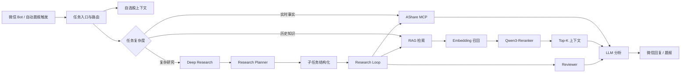

# StockPilot AI

> **以自选股为长期上下文，结合 RAG、MCP 与 Deep Research，通过微信 Bot 提供自动晨报、个股问答与复杂问题研究的 A 股智能助手。**

StockPilot AI 是一个面向个人投资者的 AI 研究助手。它不是简单回答“股票会不会涨”，而是围绕用户真实关注的自选股，持续整理新闻、产业资料、行情与财务数据，并在需要时进入多阶段 Deep Research 流程，给出带证据、反方信息和不确定性的研究结果。

---

## 1. 为什么做这个产品

个人投资研究常见的几个问题：

- 新闻、行情、公告、研报分散在不同平台，重复搜索成本高；
- 通用 LLM 的参数知识存在时效性问题，无法直接承担实时行情查询；
- 单次问答缺少长期用户上下文，不知道“我为什么关注这只股票”；
- 一次性长 Prompt 很难稳定完成复杂研究、证据核验与反方检查；
- 自动化链路中，接口返回成功并不等于用户任务真正完成。

因此 StockPilot AI 的核心不是“堆技术”，而是把不同类型的问题放进不同能力层中处理。

---

## 2. 核心产品能力

### 自选股个性化上下文

将自选股作为长期用户上下文，并进一步预留：

- 关注原因
- 买入逻辑
- 风险点
- 成本价
- 所属行业 / 产业链

目标是让 Agent 不只知道“用户关注哪只股票”，还能够理解“为什么关注”，进而判断新事件是在 **强化、削弱还是推翻** 原有投资逻辑。

### RAG + MCP 混合检索

根据数据生命周期拆分：

- **RAG**：历史新闻、产业资料、长期研究材料；
- **MCP**：行情、K 线、财报、资金流、龙虎榜、融资融券、历史 PE/PB 等高时效数据。

关键 RAG 路径支持 **Embedding 召回 → Qwen3-Reranker 重排序 → Top-K 上下文筛选**；实时金融数据不提前向量化，而是在推理阶段通过 AShare MCP 动态获取。

### Deep Research

复杂问题不直接用一次 Prompt 生成结论，而是拆成：

**Planner → 子任务结构化 → Research Loop → RAG/MCP 取证 → Reviewer → Final Report**

同时要求区分：

- 已确认事实
- 多源验证
- 弱信号
- 传闻
- 无法验证

Reviewer 还要检查反方证据和信息缺口，降低选择性引用。

### 多模型分工

不同节点按任务特征选择模型，而不是追求单一“万能模型”：

- **Ling 3.0 Flash Fin**：金融资讯理解与日常分析；
- **LongCat-2.0 / GLM**：长文本与复杂研究候选模型；
- **gpt-oss-120b**：结构化输出、固定格式整理与晨报编辑等低成本中间任务。

### 微信 Bot 产品入口

微信作为用户侧入口，后台由 Dify、RAG、MCP、Deep Research 等能力完成任务：

**微信提问 → 读取上下文 → 任务分流 → 检索/取数/研究 → 生成答案 → 微信回复**

同时 GitHub Actions 驱动每日自动晨报，使产品既支持“用户主动问”，也支持“系统主动跟踪”。

---

## 3. 系统架构

更详细的设计见：

- [产品概览](docs/产品概览.md)
- [系统架构](docs/系统架构.md)
- [RAG 与 MCP 设计](docs/RAG与MCP设计.md)
- [Deep Research 设计](docs/深度研究.md)
- [模型路由与结构化输出](docs/模型路由与结构化.md)
- [失败案例与可靠性](docs/失败案例与可靠性.md)

---

## 4. 公开版 Workflow

`workflow/` 中提供脱敏后的结构示意文件，用于展示节点关系和设计思路：

- `stockpilot-chatflow-sanitized.yml`：普通问答 + 自选股 + Deep Research 路由；
- `morning-report-sanitized.yml`：自动晨报输入、金融分析与微信友好输出。

这些文件 **不是生产环境原始导出**，已移除：

- Dify 数据集 ID
- API Key / Token
- Supabase Service Role Key
- Backblaze B2 Key
- 微信 Bridge Token
- 私人自选股与成本价
- 私有 URL / 内部资源标识

---

## 5. Prompt 与 Schema

- [Research Planner](prompts/研究规划器.md)
- [Reviewer](prompts/复核器.md)
- [晨报编辑器](prompts/晨报编辑器.md)
- [Research Task JSON Schema](schemas/research-task.schema.json)

这些文件用于展示如何把“模型自由回答”约束成可以被工作流稳定消费的中间结果。

---

## 6. 失败案例驱动的迭代

这个项目里最重要的迭代并不是继续加功能，而是把真实失败变成系统规则：

- RSS 单源失败 → **失败隔离**，避免拖垮整个晨报；
- 定时任务偶发延迟 → **主触发 + fallback**；
- 多次触发可能重复推送 → **幂等与状态控制**；
- Dify / 模型长链路超时 → **按复杂度分流，简单问题不进入 Deep Research**；
- HTTP 200 但微信业务未真正接受 → **区分网络层成功与业务状态**；
- 主模型同时承担推理和严格 JSON 输出不稳定 → **思考与结构化拆成不同节点**。

详细见 [失败案例与可靠性](docs/失败案例与可靠性.md)。

---

## 7. 与上游开源项目的关系

本项目的资讯采集部分基于开源项目 [sansan0/TrendRadar](https://github.com/sansan0/TrendRadar) 的能力进行扩展与整合。公开作品集重点展示的是在此基础上新增或重构的产品层能力，例如：

- 自选股长期上下文与 Investment Thesis Memory 思路；
- Backblaze B2 + Supabase 的数据职责拆分；
- Dify 中的 RAG / MCP / Deep Research 路由；
- 自建 [AShare MCP](https://github.com/chenyutong0702/ashare-mcp) 金融工具层；
- 多模型职责分工与 Structured Output；
- 微信 Bot 交互闭环；
- 自动晨报与失败隔离、幂等、状态校验等可靠性设计。

相关归属与许可说明见 [NOTICE.md](NOTICE.md)。

---

## 8. 项目定位

这是一个 **AI 产品设计与 Agent 工程作品集**，不构成投资建议，也不提供自动交易能力。

项目关注的不是“让模型直接预测涨跌”，而是：

> **让 AI 知道应该查什么、从哪里查、如何验证、哪些信息仍不确定，以及这些变化是否影响用户原本的投资逻辑。**
