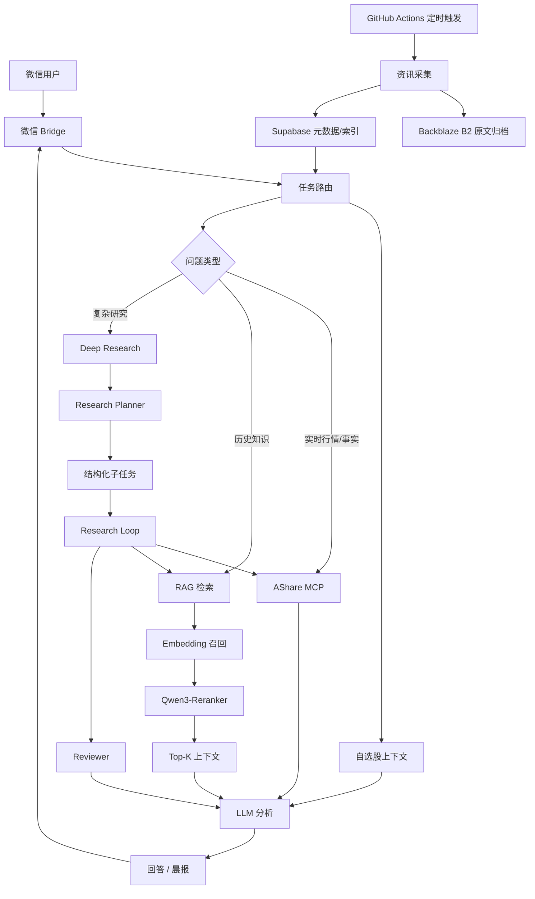

# 系统架构

## 1. 总体链路



---

## 2. 数据层

### Backblaze B2

负责保存体积较大的原始内容，例如：

- 新闻全文；
- 历史抓取内容；
- 晨报归档；
- 需要长期保留的原始材料。

### Supabase

主要保存更适合查询和检索的结构化数据，例如：

- 新闻元数据；
- 摘要；
- 自选股；
- 用户上下文；
- 检索索引；
- 业务状态。

这种拆分的目的不是追求复杂，而是在低成本环境中避免把大体积原文全部压进数据库。

---

## 3. AI 能力层

### RAG

适合承载历史材料和产业知识。

### MCP

适合承载持续变化的实时金融数据。

### Deep Research

适合处理需要多阶段拆解、取证、复核的复杂问题。

### LLM

不同节点承担不同职责，例如金融理解、复杂推理、结构化输出与最终编辑。

---

## 4. 用户交互层

### 微信 Bot

微信是主要产品入口，而不是让用户直接操作 Dify。

对用户来说，系统应该表现成：

```text
问一句话
↓
系统自动判断需要查什么
↓
调用对应数据和研究链路
↓
直接返回结果
```

### 自动晨报

GitHub Actions 定时触发采集与分析，让系统不仅能“被问”，还能主动围绕自选股整理变化。

---

## 5. 设计重点

这个架构最核心的不是节点数量，而是几个职责边界：

- 历史知识与实时数据分开；
- 简单问题与复杂研究分开；
- 推理与严格结构化分开；
- 网络请求成功与业务任务完成分开；
- 原始大文件与查询索引分开。
